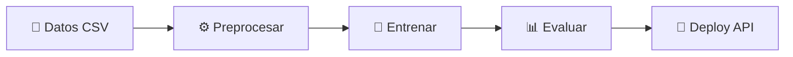
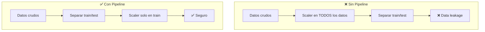
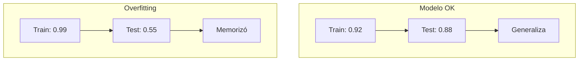

Hace un par de años hice un curso de Machine Learning. Como profesional del desarrollo de software con experiencia en Python, construyendo sistemas y desplegando APIs, pensaba que la transición sería fluida. La explicación del curso era espectacular: perceptrones, funciones de activación, redes neuronales, tablas de verdad, cómo se activan y desactivan las neuronas. Entendí la teoría, me fascinó la matemática detrás de todo. Y tiene todo el valor del mundo saber qué hay detrás de librerías como scikit-learn o TensorFlow.

Pero llegaba el momento de pensar *"¿y esto cómo lo uso con los datos de mi empresa?"*... y esa parte no la cubrían.

**Si eres desarrollador o profesional técnico que entiende programación pero sientes que los cursos de ML no te muestran cómo aplicarlo en tu trabajo, este post es para ti.** Te comparto lo que construí para cerrar esa brecha: un repositorio con algoritmos, datos de negocio y APIs listas para usar.

<figure>
  
  <figcaption>Del curso teórico al repositorio con datos reales, algoritmos y patrones de deploy. Elaboración propia con OpenCode (MiMo v2.5, Xiaomi).</figcaption>
</figure>

## El puente que busqué entre la teoría y la práctica

No me malinterpretes: aprender la teoría tiene un valor enorme. Saber qué hay detrás de las librerías, cómo funcionan las neuronas o por qué una función de activación se elige sobre otra, eso importa. Lo que me faltó no fue la teoría, sino **el puente para usarla con datos productivos**.

Revisé varios cursos sueltos, pagados y gratuitos. Los que encontré seguían un patrón parecido: te explican la teoría de forma brillante, usan datasets que vienen incluidos en scikit-learn como `load_iris` o `load_wine`, generan datos con semillas aleatorias, y todo funciona perfecto en un notebook.

Pero rara vez decían *"estos son los datos que debes tomar de tu empresa y así los debes procesar"*. No generaban esa abstracción mental para conectar lo que aprendes con lo que harías al día siguiente en el trabajo. Es como aprender a conducir en un simulador pero nunca subirte a un auto real.

En el Diplomado de Data Science en la Universidad de Chile, que estoy cursando actualmente, encontré otra forma de acercarme a estos temas. Los cursos que tomé antes no son malos, simplemente no había logrado conectarme con ellos. Ese diplomado, junto con tutoriales, videos y el apoyo de la IA para acelerar la comprensión, me ayudó a armar el panorama completo.

## Un video, una idea, un repositorio

Un día me encontré con <a href="https://www.youtube.com/watch?v=XkkOyfo8gvI" target="_blank" rel="noopener noreferrer">este video de YouTube</a> que explicaba los algoritmos más usados en Machine Learning. Tenía ejemplos, todo bien explicado. El autor plantea una idea que, aunque no sé si es del todo precisa, me sirvió para entender qué se usa en el mundo real y no ahogarme con la cantidad de algoritmos y técnicas que existen: estos 9 algoritmos son los más comunes en la mayoría de casos reales de ML.

Con eso entendí por dónde empezar. Pero había un detalle: el video **me obligaba a dejar mi correo electrónico** para acceder al material. Era una carnada para un curso pagado.

Entonces surgió la pregunta: *"¿Y si me baso en este video y creo mis propios recursos?"*

Tomé los 9 algoritmos que el video presentaba como los principales: Regresión Lineal, Regresión Logística, k-NN, Naive Bayes, Árboles de Decisión, K-Means, Random Forest, XGBoost y LightGBM. Y construí mis propios tutoriales para cada uno.

Pero no me quedé ahí. Me pregunté: *"¿Qué hay en ese 10% que no hablan?"* Así agregué Series de Tiempo (datos que cambian con el tiempo, como ventas mensuales o tráfico web), PCA (para reducir la cantidad de variables sin perder información), Isolation Forest (para detectar anomalías o fraudes) y SVM (Support Vector Machine, un algoritmo que busca la mejor frontera para separar los datos en categorías, como distinguir clientes que compran de los que no compran).

### Algoritmos principales, pros, contras y por qué elegir cada uno

| Algoritmo | Tipo | Pros | Contras | ¿Qué mejora? | ¿Por qué es mejor opción? |
|-----------|------|------|---------|---------------|---------------------------|
| **Regresión Lineal** | Regresión | Simple, rápido, fácil de interpretar | Solo relaciones lineales, sensible a outliers | | Punto de partida ideal para problemas numéricos |
| **Regresión Logística** | Clasificación | Probabilidades calibradas, regularización incluida | Solo separación lineal | | Base para clasificación binaria con interpretabilidad |
| **k-NN** | Clasificación / Regresión | Sin entrenamiento, intuitive | Lento con muchos datos, sensible a escalas | | Bueno para datasets pequeños y como referencia |
| **Naive Bayes** | Clasificación | Muy rápido, funciona bien con poco datos | Asume independencia entre variables | | Clasificación de texto y cuando hay prisa |
| **Árboles de Decisión** | Clasificación / Regresión | Fácil de visualizar y explicar | Sobreajusta fácilmente | **Random Forest** | Random Forest combina muchos árboles para reducir el error |
| **K-Means** | Clustering | Simple, escalable | Hay que definir K, formas redondas | **Isolation Forest** (para anomalías) | Isolation Forest detecta outliers sin necesidad de definir clusters |
| **Random Forest** | Clasificación / Regresión | Robusto, pocos hiperparámetros | Lento con muchos árboles, menos preciso que boosting | **XGBoost / LightGBM** | Boosting corrige errores secuencialmente, mejor precisión |
| **XGBoost** | Clasificación / Regresión | Alta precisión, regularización, maneja datos faltantes | Más complejo de configurar, más lento que LightGBM | **Random Forest** | Mejor rendimiento en competiciones y producción |
| **LightGBM** | Clasificación / Regresión | Entrena más rápido que XGBoost, maneja grandes volúmenes | Puede sobreajustar con pocos datos | **XGBoost** | Misma precisión, menos tiempo de entrenamiento |
| **SVM** | Clasificación | Efectivo en alta dimensionalidad, kernel trick | Lento con muchos datos, difícil de interpretar | **Regresión Logística** | Cuando la separación no es lineal y el dataset no es enorme |
| **PCA** | Reducción de dimensionalidad | Reduce variables sin perder mucha info | Difícil de interpretar los componentes | | Preprocesamiento antes de otros algoritmos |
| **Series de Tiempo** | Regresión temporal | Captura tendencias y estacionalidad | Requiere datos ordenados y suficientes | | Ventas, tráfico web, cualquier dato que cambie en el tiempo |
| **Isolation Forest** | Detección de anomalías | No necesita labels, detecta outliers automáticamente | Sensible a la proporción de anomalías | **K-Means** (para anomalías) | Más directo que clustering para encontrar lo anómalo |

Luego vino otra pregunta: *"¿Cómo se publican estos modelos para usarlos más adelante o en ambientes productivos?"* Así descubrí `joblib.dump` para serializar modelos (guardar el modelo entrenado en un archivo para reusarlo después). Ya conocía Flask, lo uso para APIs e interfaces web simples y económicas, pero no había conectado ambas piezas: exportar un modelo entrenado y servirlo en un endpoint REST (un punto de acceso al que otros programas pueden enviar datos y recibir respuestas). De esa conexión nació el patrón de `api.py` que tiene cada tutorial.

Cada algoritmo principal pasó a tener varios tutoriales de ejemplo con casos de negocio reales: publicidad, seguros, fraude, vuelos, delivery, inventario. El repo fue creciendo hasta tener algoritmos y ejemplos variados, todos ejecutables desde la terminal. Encontrarás casos concretos en el <a href="https://github.com/edgardo001/python-ml-algoritmos-mas-usados" target="_blank" rel="noopener noreferrer">repositorio en GitHub</a>.



## Lo que cambia cuando piensas en producción

La diferencia que noté entre los tutoriales que revisé y algo que funciona en una empresa es **el contexto de los datos**. En el repo, los datos no son `iris` ni `make_classification`. Son CSVs con sentido de negocio:

- **Ventas de publicidad**: `gasto_tv`, `gasto_radio`, `gasto_digital` predicen ventas
- **Siniestros de seguro**: `edad`, `antiguedad`, `multas`, `km` predicen siniestro sí/no
- **Vuelos**: distancia, anticipación, ocupación predicen precio
- **Fraude**: `monto`, `hora`, `es_extranjero`, `distancia_km` predicen fraude sí/no

Cuando ves esos datos, empiezas a pensar: *"Esto es similar a lo que tengo en mi empresa"*. Y eso genera la conexión que los cursos que revisé no lograron darme. Cada caso tiene su propio tutorial ejecutable en el <a href="https://github.com/edgardo001/python-ml-algoritmos-mas-usados" target="_blank" rel="noopener noreferrer">repositorio</a>.

Claro, en la empresa real los datos no llegan limpios. Los CSVs tienen errores, faltan valores, las columnas tienen nombres inconsistentes. Estos tutoriales usan datos ya preparados para que el foco esté en el algoritmo, no en la limpieza. Pero el primer paso siempre es eso: entender tus datos y dejarlos listos antes de entrenar nada.

Una vez que tienes los datos, la siguiente pregunta es: ¿cómo configuro el modelo para que funcione bien?

## El patrón que descubrí: GridSearchCV

Una de las cosas que más me sorprendió al pasar de los tutoriales a la práctica es que no se trataba de usar el algoritmo con parámetros por defecto. En la realidad, esos parámetros (llamados **hiperparámetros**, que son las configuraciones que elegimos antes de entrenar el modelo) marcan la diferencia entre un modelo útil y uno que no sirve.

Mientras intentaba entender cómo configurar los hiperparámetros, encontré **GridSearchCV**, una herramienta de scikit-learn que prueba automáticamente muchas combinaciones y te dice cuál funciona mejor. Es como tener un asistente que prueba todas las opciones por ti.

<figure>
  
  <figcaption>GridSearchCV prueba cada combinación y se queda con la que tiene menor error. Elaboración propia con OpenCode (MiMo v2.5, Xiaomi).</figcaption>
</figure>

En ML, `X` son las columnas de entrada (edad, ingresos, etc.) e `y` es lo que queremos predecir (precio, si compró, etc.). Aquí un ejemplo real del repo, usando GridSearchCV para Regresión Lineal:

```python
    # GridSearchCV busca la mejor combinación de hiperparámetros
    grilla = {"fit_intercept": [True, False], "positive": [False, True]}
    grid = GridSearchCV(LinearRegression(), grilla, cv=5,
                        scoring="neg_mean_squared_error", n_jobs=-1)
    grid.fit(X_train, y_train)
    print(f"Mejor combinacion: {grid.best_params_}")
    modelo = grid.best_estimator_  # ya viene reentrenado con todo train
```

`cv=5` significa que divide los datos de entrenamiento en 5 pliegues y prueba cada combinación 5 veces, rotando cuál pliegue se usa para validación. `n_jobs=-1` usa todos los núcleos del procesador. scikit-learn usa el <a href="https://koshurai.medium.com/understanding-mean-squared-error-mse-in-machine-learning-442795910802" target="_blank" rel="noopener noreferrer">MSE (error cuadrático medio)</a> en negativo porque GridSearchCV siempre **maximiza**: el valor más alto (el más cercano a 0) corresponde al menor error.

Esto es lo que diferencia un modelo de producción de uno de demo: **no adivinar los parámetros, buscarlos sistemáticamente**. Pero ojo: GridSearchCV te dice cuál combinación funciona mejor dentro de los datos de entrenamiento. Para confirmar que el modelo realmente generaliza, el paso final es evaluarlo en un conjunto de **test** separado, que nunca se usó ni en el entrenamiento ni en la validación cruzada. Son dos preguntas distintas: GridSearchCV responde "¿cuál es la mejor configuración?" y el diagnóstico train vs test responde "¿funciona con datos nuevos?"

## El Pipeline: encadenar pasos correctamente

Otro patrón que no encontré en los cursos que revisé es el **Pipeline**. En scikit-learn, un Pipeline te permite encadenar pasos de preprocesamiento con el modelo en un solo objeto.

Por qué importa: si necesitas escalar los datos (<a href="https://scikit-learn.org/stable/modules/generated/sklearn.preprocessing.StandardScaler.html" target="_blank" rel="noopener noreferrer">StandardScaler</a>, que <a href="https://enlinea.iztacala.unam.mx/resources/modules/MetodoyEstadistica/Recursos/fichero-verticalS1/" target="_blank" rel="noopener noreferrer">estandariza cada variable para que tenga media 0 y desviación 1</a>, de modo que edades y salarios queden en una escala comparable) y luego entrenar un SVM, hacerlo por separado puede causar **data leakage** (fuga de datos), que es cuando el modelo "ve" información del conjunto de prueba durante el entrenamiento, lo que da resultados engañosos.

Un ejemplo simple: imagina que tienes 1000 filas de datos y separas 800 para entrenar y 200 para test. Si aplicas StandardScaler **antes** de separar, el scaler calcula la media y desviación estándar usando las 1000 filas, incluidas las 200 de test. Eso significa que el modelo recibe información indirecta de los datos de prueba: ya "conoce" el rango de esos valores antes de evaluar. El resultado parece bueno en el notebook, pero en producción, con datos nuevos que el scaler nunca vio, el modelo falla. Con Pipeline, el scaler se ajusta solo dentro de cada pliegue de entrenamiento durante la validación cruzada, y el pliegue de validación se transforma con los parámetros del scaler de entrenamiento, sin contaminarse.



```python
    tubo = Pipeline([
        ("scaler", StandardScaler()),
        ("svc", SVC(probability=True, random_state=42)),
    ])
    grilla = {
        "svc__C": [0.1, 1, 10],
        "svc__kernel": ["rbf", "linear"],
        "svc__gamma": ["scale", "auto"],
    }
    grid = GridSearchCV(tubo, grilla, cv=3, scoring="f1", n_jobs=-1)
    grid.fit(X_train, y_train)
```

La notación `svc__C` significa "el parámetro `C` del paso `svc` dentro del Pipeline". `scoring="f1"` es una métrica que balancea precisión y recall (útil cuando las clases están desbalanceadas). Todo queda encapsulado: cuando guardas el modelo con `joblib.dump`, guardas el Pipeline completo, scaler incluido.

## Diagnóstico de overfitting: la prueba de realidad

En los tutoriales que revisé, el modelo se entrena, se evalúa y se muestra la **accuracy** (el porcentaje de predicciones correctas). Pero **rara vez comparan train vs test** para detectar si el modelo está memorizando en vez de aprender.

**Train** son los datos con los que se entrenó el modelo. **Test** son datos que el modelo nunca vio. Si el modelo funciona bien en train pero mal en test, significa que memorizó las respuestas en vez de aprender el patrón.



Este es el patrón que uso en cada tutorial:

```python
    train_acc = accuracy_score(y_train, modelo.predict(X_train))
    pred = modelo.predict(X_test)
    acc = accuracy_score(y_test, pred)

    if abs(train_acc - acc) < 0.15:
        diagnostico = "OK: train y test parecidos"
    else:
        diagnostico = "ALERTA: posible sobreajuste (train mucho mejor que test)"
```

Si la accuracy en train es 0.95 y en test es 0.60, el modelo memorizó los datos de entrenamiento pero no generaliza. Esto es **overfitting** (sobreajuste), que es cuando el modelo aprende demasiado bien los datos de entrenamiento y falla con datos nuevos. Es uno de los errores más comunes en ML.

El umbral de 0.15 en el código es una referencia arbitraria, no una regla universal. En la práctica, cada dominio tolera diferencias distintas: en un sistema de recomendación de películas, una diferencia de 0.10 puede ser aceptable. En un modelo de fraude financiero o diagnóstico médico, donde un falso negativo tiene consecuencias reales, querrás un umbral mucho más bajo (0.03 o 0.05) y métricas más allá de la accuracy, como F1 o AUC-ROC. La idea del diagnóstico automático no es darte un número mágico, sino alertarte antes de que un modelo con métricas infladas llegue a producción.

## La pieza que no encontré: deploy con Flask

Un paso que no encontré en los tutoriales que revisé es **cómo sirves un modelo para que otros lo usen**. Como ya trabajaba con Flask para desarrollo web, la conexión fue natural: exportar el modelo con `joblib.dump` y crear un punto de acceso que lo reciba y prediga. En el repo, cada tutorial incluye un `api.py` con Flask que expone dos endpoints (puntos de acceso):

- `GET /health`: verifica que el modelo esté cargado y funcionando
- `POST /predict`: recibe datos, los valida y devuelve una predicción

```python
CAMPOS = {"gasto_tv": (0, 1000), "gasto_radio": (0, 500), "gasto_digital": (0, 500)}

def validar(payload):
    errores, valores = [], {}
    for campo, (vmin, vmax) in CAMPOS.items():
        if campo not in payload:
            errores.append(f"falta el campo '{campo}'")
            continue
        try:
            v = float(payload[campo])
        except (TypeError, ValueError):
            errores.append(f"'{campo}' debe ser numerico")
            continue
        if not (vmin <= v <= vmax):
            errores.append(f"'{campo}' fuera de rango [{vmin}, {vmax}]")
            continue
        valores[campo] = v
    return valores, errores
```

En palabras simples: antes de predecir, la API revisa que todos los campos requeridos existan, sean números y estén dentro de rangos razonables. Si algo falla, responde con un error claro indicando qué está mal, y si el modelo no está listo, avisa que no puede predecir. Esto es lo que diferencia un script de demo de algo que puedes poner frente a otros usuarios o consumidores.

### En producción real, también necesitarías

El `api.py` del repo es un ejemplo básico para comprender el patrón. En un entorno productivo, también necesitarías:

- **Monitoreo continuo de predicciones**: rastrear si las predicciones cambian con el tiempo, porque los modelos se degradan a medida que cambian los datos del mundo real
- **Detección de desviaciones en los datos**: alertar cuando los datos de entrada cambian de distribución (por ejemplo, si de repente llegan valores fuera de los rangos habituales)
- **Versionado de modelos**: mantener un registro de qué versión del modelo está desplegada y poder volver a una anterior si algo falla
- **Logging detallado**: registrar cada predicción, los datos de entrada y el tiempo de respuesta para poder auditar y depurar problemas

Estos son los mismos principios que aplico en desarrollo de software: observabilidad, trazabilidad y rollback. ML no es diferente.

## Cierre

Después de armar este repo me di cuenta de algo: **el conocimiento de ML no falta, lo que a veces falta es el puente entre la teoría y la práctica real**. Los cursos que revisé me dieron las piezas, pero no siempre me mostraron cómo armar el rompecabezas con datos de mi empresa, cómo serializar el modelo, cómo servirlo en una API, o cómo diagnosticar si está sobreajustado.

Mi aprendizaje vino de varias fuentes: cursos externos, el diplomado en la Universidad de Chile (que llevo poco tiempo cursando), tutoriales, videos y el apoyo de la IA para acelerar la comprensión. Pero la pieza que faltaba era conectarlo todo con un caso de uso real. Ese fue el puntapié para construir este repositorio.

Siendo honesto, este repo es un **punto de partida**, no un sistema de producción completo. No es la verdad absoluta, pero es mi visión después de este recorrido. En una empresa real también hay que considerar monitoreo continuo, versionado de datos, CI/CD y seguridad. Tampoco soy experto en ML, así que puede contener errores o formas de hacer las cosas que con el tiempo iré mejorando.

Construí este repo para conectar lo que ya sabía de desarrollo con lo nuevo que estaba aprendiendo de ML. Si te sirvió como punto de partida para conectar teoría con práctica, me alegra. Y si encontras formas de mejorarlo, mejor aún.

Si tienes preguntas, dudas o simplemente quieres conversar sobre esto, puedes contactarme por <a href="https://www.linkedin.com/in/edgardo-vasquez/" target="_blank" rel="noopener noreferrer">LinkedIn</a>. También me ayuda a mejorar mi comprensión y aprendizaje del mundo del Data Science.

👉 <a href="https://github.com/edgardo001/python-ml-algoritmos-mas-usados" target="_blank" rel="noopener noreferrer">github.com/edgardo001/python-ml-algoritmos-mas-usados</a>

Algoritmos y ejemplos listos para usar, ejecutables desde la terminal. Una perspectiva diferente para aprender ML.
